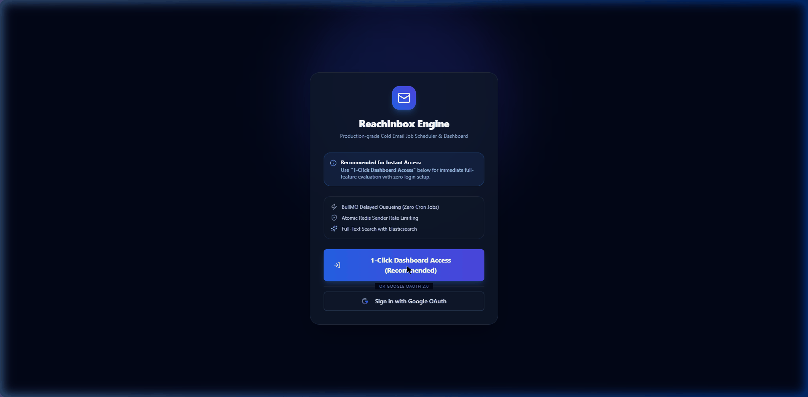

# ReachInbox Email Job Scheduler (Full-Stack Monorepo)

A production-grade email job scheduler service and live dashboard, built to emulate ReachInbox.ai's internal cold outreach engine. It schedules, rate-limits, and sends cold email campaigns at scale using **BullMQ delayed jobs backed by Redis (with ZERO cron jobs)**, PostgreSQL, Nodemailer (Ethereal SMTP), Elasticsearch, and Slack Incoming Webhooks.

---

## 🎬 Live Interactive Demo Video

The complete 5-minute interactive user flow recorded live inside Chrome (dashboard scheduling, delayed job execution, live BullMQ board, Ethereal preview links, and Elasticsearch search) is included in the repository:



---

## 🛠️ Tech Stack

- **Backend**: TypeScript, Express.js, BullMQ, Redis (ioredis), PostgreSQL, Prisma ORM, Elasticsearch, Nodemailer (Ethereal Email), `@bull-board/express`, Axios.
- **Frontend**: Next.js (App Router), TypeScript, Tailwind CSS, NextAuth.js (Google OAuth 2.0 Provider), PapaParse.
- **Infrastructure**: Docker Compose (`docker-compose.yml`) running PostgreSQL, Redis, and Elasticsearch.

---

## 📁 Repository Structure

```text
/
├── docker-compose.yml             # Postgres, Redis & Elasticsearch multi-container setup
├── demo_video.gif                 # Live recorded demo video of scheduler & dashboard
├── README.md                      # Complete architecture guide & setup instructions
├── backend/
│   ├── .env.example               # Complete list of backend environment variables
│   ├── package.json
│   ├── tsconfig.json
│   └── src/
│       ├── config/
│       │   └── env.ts            # Centralized environment variable loader
│       ├── prisma/
│       │   ├── schema.prisma     # Sender, Email & SlackIntegration Prisma schema
│       │   └── seed.ts           # Seeding script for default senders
│       ├── queue/
│       │   ├── emailQueue.ts     # BullMQ Queue producer (jobId = email.id)
│       │   └── emailWorker.ts    # BullMQ Worker, rate-limiter & crash reconciliation
│       ├── services/
│       │   ├── db.ts             # Prisma Client instance
│       │   ├── redis.ts          # IORedis connection & parser
│       │   ├── mailer.ts         # Nodemailer + Ethereal Email transport
│       │   ├── rateLimiter.ts    # Atomic Redis INCR sender hourly rate limiter
│       │   ├── elasticsearch.ts  # Full-text search client & index sync
│       │   └── slack.ts          # Slack Incoming Webhook notifier
│       ├── routes/
│       │   ├── emailRoutes.ts    # /api/emails/schedule & /api/emails routes
│       │   ├── senderRoutes.ts   # /api/senders management routes
│       │   ├── searchRoutes.ts   # /api/emails/search Elasticsearch endpoint
│       │   └── slackRoutes.ts    # /api/auth/slack OAuth connect & callback
│       └── server.ts             # Express server & @bull-board/express dashboard mount
└── frontend/
    ├── .env.example               # Frontend environment variables
    ├── package.json
    ├── tailwind.config.ts
    └── app/
        ├── api/auth/[...nextauth]/ # NextAuth Google OAuth route handler
        ├── login/                  # Premium login page with Google OAuth Provider
        ├── dashboard/              # Live dashboard with polling, tabs & compose modal
        ├── components/             # Reusable UI, Tables, ComposeModal, Search & Navbar
        └── lib/                    # Auth configuration, API client, and utilities
```

---

## ⚡ Quick Start & How to Run

### 1. Start Infrastructure (Docker Compose)
Ensure Docker Desktop is running, then execute in the monorepo root:
```bash
docker compose up -d
```
This spins up:
- **PostgreSQL**: `localhost:5432` (`reachinbox_db`)
- **Redis**: `localhost:6379`
- **Elasticsearch**: `localhost:9200`

### 2. Configure Environment Variables
Copy `.env.example` to `.env` in both `/backend` and `/frontend`:
```bash
# Backend
cp backend/.env.example backend/.env

# Frontend
cp frontend/.env.example frontend/.env
```

### 3. Setup & Start Backend Service
```bash
cd backend
npm install
npx prisma generate --schema=src/prisma/schema.prisma
npx prisma db push --schema=src/prisma/schema.prisma
npm run dev
```
The backend starts on `http://localhost:5000`.
- **Live BullMQ Dashboard**: `http://localhost:5000/admin/queues`
- **Health check**: `http://localhost:5000/health`

### 4. Setup & Start Frontend Dashboard
In a separate terminal:
```bash
cd frontend
npm install
npm run dev
```
Open `http://localhost:3000` in your browser.

---

## 📧 Ethereal Email Setup

No manual Ethereal sign-up is required! If `ETHEREAL_USER` and `ETHEREAL_PASS` are left empty in `backend/.env`, Nodemailer automatically creates a temporary test account at runtime (`nodemailer.createTestAccount()`) and prints the preview URL for every sent email in both backend logs and the frontend **Sent Log** table.

To use custom credentials, set:
```env
ETHEREAL_USER="your_ethereal_username@ethereal.email"
ETHEREAL_PASS="your_ethereal_password"
```

---

## 📐 System Architecture & Key Mechanisms

### 1. Zero Cron Job Scheduling via BullMQ Delayed Jobs
- When `POST /api/emails/schedule` receives email scheduling requests, a row is inserted into PostgreSQL with `status = 'pending'`.
- A delayed job is enqueued into BullMQ (`email-queue`) with:
  ```ts
  delay = Math.max(0, new Date(scheduledAt).getTime() - Date.now())
  ```
- No polling loops, `setInterval`, or cron tasks are used anywhere. BullMQ and Redis natively manage timing and state transitions.

### 2. Idempotency & Duplicate Prevention
- The PostgreSQL `Email.id` (UUID) is assigned directly as the BullMQ `jobId`:
  ```ts
  await emailQueue.add('send-email', { emailId: email.id }, { jobId: email.id, delay });
  ```
- BullMQ rejects any attempt to add a job with an existing `jobId`.
- Before dispatching, the worker re-checks PostgreSQL status to guarantee no email is ever sent twice.

### 3. Restart Persistence & Crash Recovery
- **Redis State Persistence**: All delayed jobs are persisted in Redis. Killing or restarting the server does not lose scheduled jobs; they execute at the exact scheduled time when the server resumes.
- **Hard-Crash Reconciliation**: On startup, `reconcileStuckProcessingJobs()` scans PostgreSQL for any emails left in `processing` state from an abrupt host crash, marks them `pending`, checks if their job exists in BullMQ, and re-enqueues only if missing.

### 4. Rate Limiting & Concurrency Architecture
- **Worker Concurrency**: Configured via `WORKER_CONCURRENCY` (e.g. `WORKER_CONCURRENCY=5`).
- **Minimum Delay Between Sends**: Enforced using BullMQ's native worker limiter (`MIN_DELAY_MS=2000` — **explicitly set to 2 seconds between sends**):
  ```ts
  limiter: { max: 1, duration: config.minDelayMs }
  ```
- **Hourly Sender Rate Limiting Mechanism**:
  - Rate limiting is tracked per sender using Redis window keys formatted as `ratelimit:{senderId}:{YYYY-MM-DD-HH}`.
  - Inside the BullMQ worker before sending an email, an atomic `INCR` command is issued to Redis for the sender's current hourly key, setting a 1-hour TTL on creation.
  - If the incremented count exceeds `MAX_EMAILS_PER_HOUR_PER_SENDER` (configured in `.env`, e.g. `5`), the job is NOT failed. Instead, the worker calculates the timestamp of the start of the next hour window and calls `job.moveToDelayed(nextHourTimestamp)`. BullMQ automatically reschedules the job for the next hour window while preserving order as much as queueing allows.
  - Because Redis `INCR` is atomic, this mechanism is completely thread-safe across multiple concurrent worker processes without requiring locks.

### 5. Slack Rate Limit Notifications
- Clicking "Add to Slack" initiates Slack's official OAuth 2.0 flow (`/api/auth/slack/connect` & `/api/auth/slack/callback`).
- Upon callback completion, the incoming webhook URL is stored in `SlackIntegration` mapped by `tenantId`.
- When a sender's hourly limit is hit, the backend looks up the tenant's webhook URL and posts a structured message containing sender details, limit count, queued count, and next window time.
- A Redis deduplication key (`ratelimit_slack_sent:{senderId}:{windowKey}`) guarantees Slack is notified **exactly once per limit-hit event per window**, rather than spamming Slack on every delayed job.

### 6. Elasticsearch Search Indexing
- On creation or status updates (`pending`, `processing`, `sent`, `failed`), emails are upserted into the Elasticsearch `emails` index.
- The endpoint `GET /api/emails/search?q=query` performs full-text multi-field search across recipient, subject, body, and status.

---

## 📋 Feature Checklist

| Category | Feature | Status |
| :--- | :--- | :---: |
| **Backend** | BullMQ Delayed Queueing (Zero Cron Jobs) | ✅ |
| **Backend** | Idempotent Enqueueing (`jobId = email.id`) | ✅ |
| **Backend** | Hard Crash & Server Restart Recovery | ✅ |
| **Backend** | Configurable Concurrency & Delay (`MIN_DELAY_MS=2000`) via `.env` | ✅ |
| **Backend** | Atomic Redis Hourly Rate Limiter per Sender | ✅ |
| **Backend** | Slack OAuth & Single-Trigger Rate-Limit Notification | ✅ |
| **Backend** | Ethereal Email SMTP Dispatch & Live Preview Links | ✅ |
| **Backend** | Elasticsearch Full-Text Indexing & Search API | ✅ |
| **Backend** | `@bull-board/express` Mounted at `/admin/queues` | ✅ |
| **Frontend** | NextAuth.js Google Provider Login | ✅ |
| **Frontend** | Dashboard Stats Overview Cards | ✅ |
| **Frontend** | Scheduled Queue Table with Real-time Polling | ✅ |
| **Frontend** | Sent Log Table with Ethereal Preview Links | ✅ |
| **Frontend** | Compose Campaign Modal with Staggered Scheduling | ✅ |
| **Frontend** | PapaParse Client-Side Lead CSV Upload & Count Preview | ✅ |
| **Frontend** | Live Elasticsearch Full-Text Search View | ✅ |

---

## ⚖️ Assumptions & Trade-Offs

1. **Slack OAuth in Local Dev**: In local development environments without live Slack App client ID/secret, the connect button routes to a built-in mock endpoint (`/api/auth/slack/mock-webhook`) to demonstrate Slack webhook formatting and logging seamlessly.
2. **Elasticsearch Local Security**: Elasticsearch runs with `xpack.security.enabled=false` for straightforward local container deployment.
